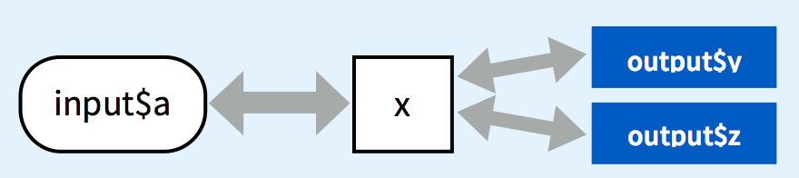
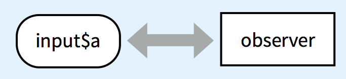

# 前言
```{r Preface}
```


## 有位教授曾經這樣說 {.flexbox .vcenter .emphasized}

你們統計所畢業的人做的工作都很奇特


## About Me

```{r include=FALSE}
source("source/get_timeline.R", local = TRUE)
```

<iframe src="charts/timeline.html"></iframe>


## 工作上常常遇到的狀況

<iframe width="960" height="720" src="//www.youtube.com/embed/MNFcBXaVIx8?rel=0&amp;controls=0" frameborder="0" allowfullscreen></iframe>

<div class="notes">
I have no idea what you're talking about...
</div>


## [Elaboration Likelihood Model](http://en.wikipedia.org/wiki/Elaboration_likelihood_model)

個人由於「動機」以及「能力」的不同，對於資訊會有不同的處理方式。

- 中心途徑(central route)

    個人具有高度的動機和能力時，會考慮和推敲勸說情況中的各個方面，以決定是否改變對事物的態度。

- 外圍途徑(peripheral route)

    個人之動機與能力相對較弱時，更容易被表觀特徵所說服。


## {.flexbox .vcenter .emphasized}

<span>今天談談怎麼使用R做出動來動去  
<span style="text-decoration: line-through;">但用途不明</span>的有趣圖表</span>


# googleVis

## googleVis

What:

- 一個讓資料科學家能快速產出互動圖表之方便工具
- 使用者可在R中使用[Google Chart Tools](https://developers.google.com/chart/)
- 輸出html程式碼，中間亦會鑲嵌對應之javascript或flash
- [圖形範例](http://cran.r-project.org/web/packages/googleVis/vignettes/googleVis_examples.html)

Why:

- 歷史悠久(2010~)
- 在CRAN即可下載
- 能完成大部分基本的統計圖表


## 應用方式

- localhost

    使用plot.gvis()在localhost產出圖形

- knitr

    chunk option: results='asis'
    - print.gvis(foo, "chart")
    - 存為獨立的檔案再使用iframe載入

- shiny

    使用renderGvis()在shiny中產生圖形
  

## 注意事項

- 需要網路連線才能使用
- 所有圖形之輸入資料皆為data.frame
- options參數以List型態輸入，中間可能包括json物件
- Motion、Annotated Time Lines和Geo Maps需要Flash
- 在本地資料夾使用motion chart需設定flash安全安全性
- html slides相容性，有時需要重新整理頁面才能有良好的解析度


## 讀取googleVis

```{r}
library(googleVis)
```


## 臺北旅遊網-景點資料

使用jsonlite可以很輕鬆地把json array讀為data frame

- 資料來源
  [臺北旅遊網-景點資料(中文)](http://data.taipei.gov.tw/opendata/apply/query/MzVERDUyOTItNjI1NC00NjcyLUE3OEItNDY3ODhDMURFM0Yy?$format=json)


```{r message=FALSE, cache=FALSE}
library(jsonlite)
travel_file = "data/data.json"
# fileurl = "http://data.taipei.gov.tw/opendata/apply/query/MzVERDUyOTItNjI1NC00NjcyLUE3OEItNDY3ODhDMURFM0Yy?$format=json"
# download.file(fileurl, destfile=travel_file)
travel_json = readLines(travel_file, warn=FALSE, encoding="UTF-8")
travel_data = fromJSON(travel_json, simplifyVector = TRUE)
```


## {.smaller}

```{r echo=TRUE}
str(travel_data)
```


## 經緯度和超連結

從原始資料中組合出經緯度與超連結的格式供googleVis使用

```{r}
travel_data$LatLon = paste(travel_data$latitude, travel_data$longitude, sep=":")
travel_data$LatLon[1]
```

```{r }
travel_data$tips = paste("<a href='",
                         travel_data$xurl,
                         "'>",
                         travel_data$stitle, 
                         "</a>",
                         sep="")
travel_data$tips[1]
```


## gvisTable

```{r results='asis'}
gvisdata = data.frame(travel_data[, c("tips", "memo_tel", "LatLon", 
                                      "address", "mrt")])
Table = gvisTable(gvisdata, options=list(page="enable"))
print(Table, "chart")
```


## gvisMap

將景點資訊以超連結標示在地圖上，先儲存為獨立的html檔再使用iframe讀進來。

```{r}
Map = gvisMap(travel_data, "LatLon", "tips",
              options=list(showTip=TRUE, 
                           enableScrollWheel=T,
#                            width=750, height=500,
                           useMapTypeControl=T,
                           mapType='normal'
                           )
              )
cat(Map$html$header, Map$html$chart, Map$html$footer, 
    sep = "\n", file="charts/Map.html")
```

```html
<iframe src="charts/Map.html"></iframe>
```

##

<iframe src="charts/Map.html"></iframe>


## gvisBar

將捷運站附近有超過五個景點之挑出來以長條圖呈現。

```{r}
mrt = table(travel_data$mrt)
gvisdata = data.frame(mrt)
gvisdata = gvisdata[order(gvisdata[, 2], decreasing=T), ]
gvisdata[which(gvisdata[,1] == ""), ] = NA
Bar = gvisBarChart(gvisdata[which(gvisdata[,2]>5),],
                   options=list(width=980, height=500,
                                hAxis="{'minValue': 0}"
                                )
                   )
```

##

```{r results='asis'}
print(Bar, "chart") 
```


## gvisHistogram & gvisMerge

畫出經、緯度的直方圖並將兩張圖合併起來。

```{r}
hist_lat = gvisHistogram(data.frame(lat = as.numeric(travel_data$latitude)),
                         options = list(vAxis = "{'title': 'Latitude'}",
                                        hAxis = "{'title': 'Frequency'}",
                                        legend = "{'position': 'none'}",
                                        histogram = "{'hideBucketItems': 'true'}",
                                        orientation = "vertical",
                                        width = 500, height = 500))
hist_lon = gvisHistogram(data.frame(lon = as.numeric(travel_data$longitude)),
                         options = list(vAxis = "{'title': 'Frequency'}",
                                        hAxis = "{'title': 'Longitude', 
                                                  'slantedText': 'true'}",
                                        legend = "{'position': 'none'}",
                                        histogram = "{'hideBucketItems': 'true'}",
                                        width = 500, height = 500))
hist_latlon = gvisMerge(hist_lat, hist_lon, horizontal = TRUE)
```


## 

```{r results='asis'}
print(hist_latlon, "chart")
```


## 薪資及生產力統計資料


這裡我們使用
[薪資及生產力統計資料查詢系統](http://win.dgbas.gov.tw/dgbas04/bc5/EarningAndProductivity/Default.aspx)
之資料來示範Motion Chart。


```{r message=FALSE}
worker_data = read.csv("data/worker_data.csv", stringsAsFactors=F)

colnames(worker_data) = gsub("\\.", "", colnames(worker_data))
worker_data[worker_data == "-"] = NA
index = which(colnames(worker_data) != "行業")
for(i in index){
    worker_data[, i] = as.numeric(worker_data[, i])
}
worker_data$時間年 = worker_data$時間年 + 1911
worker_data$平均時薪 = worker_data$平均薪資/worker_data$平均工時
```

---

```{r}
str(worker_data)
```


## Motion Chart

```{r results='asis'}
Motion = gvisMotionChart(worker_data, 
                         idvar="行業", 
                         timevar="時間年",
                         xvar="受僱員工人數",
                         yvar="平均時薪")
```

---

```{r results='asis'}
# plot(Motion)
print(Motion, "chart")
```


# 其他相關套件

## [rCharts](http://rcharts.io/#)

- 集結了目前時下最熱門的Javascript圖形套件
- 目前還沒放上CRAN，需從github安裝：
```r
require(devtools)
install_github('rCharts', 'ramnathv')
```
- 文件相對來說較為不完整，若要做細部調整需略懂Javascript較容易上手
- Share
    - save(): 另存html
    - show('inline', include_assets = TRUE, cdn = TRUE): knitr
- [圖形範例](http://rcharts.io/gallery/)


## NVD3 Example


```{r results='asis'}
hair_eye_male <- subset(as.data.frame(HairEyeColor), Sex == 'Male')
library(rCharts)
n1 <- nPlot(Freq ~ Hair, group = 'Eye', data = hair_eye_male, type = 'multiBarChart')
n1$save("charts/nvd3.html")
# n1$show('inline', include_assets = TRUE, cdn = TRUE)
```

```html
<iframe src="charts/nvd3.html"></iframe>
```

## NVD3 Example

<iframe src="charts/nvd3.html"></iframe>


## Timeline Example - Code

<div class="code_block">

get_timeline.R:

```{r results='asis', echo=FALSE}
catfile = "source/get_timeline.R"
cat("```r",
    readChar(catfile, nchars = file.info(catfile)$size),
    "```",
    sep = "\n"
    )
```

Load with iframe:

```html
<iframe src="charts/timeline.html"></iframe>
```

</div>


## Timeline Example - YAML file


<div class="code_block">

```{r results='asis', echo=FALSE}
catfile = "data/history.yaml"
cat("```yaml",
    readChar(catfile, nchars = file.info(catfile)$size),
    "```",
    sep = "\n"
    )
```

</div>


## ggvis

- 2014年中才放在CRAN的套件，目前還不算穩定
- 使用pipe，語法類似plot


```{r message=FALSE, echo=TRUE}
library(knitr)
library(ggvis)
out = mtcars %>%
    ggvis(x = ~wt, y = ~mpg) %>%
    layer_smooths(se=TRUE, opacity := 0.5, opacity.hover := 0.75) %>% 
    layer_points(fill = ~factor(cyl), size := 50, size.hover := 200) %>%
    set_options(hover_duration = 250) 
```

## ggvis

```{r message=FALSE, echo=FALSE, fig.height=5, fig.width=8}
out
```


# Shiny

## Shiny

- R語言中目前最熱門的網頁應用程式框架
- 不需具備Javascript之知識亦可輕鬆開發互動式網頁應用
- 基本架構：
    - server.R
        負責後端資料處理與運算
    - ui.R
        負責前端使用者界面的呈現
    - global.R(optional)
        放置ui和server共用的設定


## Basic server.R


```{r results='asis', echo=FALSE}
catfile = "apps/cheatsheet/server.R"
cat("```r",
    readChar(catfile, nchars = file.info(catfile)$size),
    "```",
    sep = "\n"
    )
```


## Basic ui.R

<div class="code_block">

```{r results='asis', echo=FALSE}
catfile = "apps/cheatsheet/ui.R"
cat("```r",
    readChar(catfile, nchars = file.info(catfile)$size),
    "```",
    sep = "\n"
    )
```

</div>


## Reactivity

當輸入改變時，server會重新執行和該輸入有相依性的程式碼

- render*
- reactive
- isolate
- observe


## render*

當UI中的a改變時，會重新執行該段程式碼並產生z

```r
output$z <- renderText({
    input$a 
})
```


## reactive

當UI中的a改變時，會重新產生x，x的結果可以在多個output使用

```r
x <- reactive({
    input$a
})
output$z <- renderText({
    x()
})
output$z <- renderText({
    x()
})
```



## isolate

當UI中的a改變時，不會重新執行這段程式，僅有在b改變的時候才會重新執行並產生z

```r
output$z <- renderText({
    paste(
        isolate(input$a),
        input$b 
    )
)
```


## observe

當UI中的a改變時，不會重新執行這段程式，但不會產生新的物件

```r
observe({ 
    input$a
    # code to run
})
```



## 

<!--iframe src="http://spark.rstudio.com/mansunkuo/googleVis_shiny/"></iframe-->
<iframe src="https://mansunkuo.shinyapps.io/googleVis_shiny/"></iframe>


## server.R

<div class="code_block">

```{r results='asis', echo=FALSE}
catfile = "apps/googleVis_shiny/server.R"
cat("```r",
    readChar(catfile, nchars = file.info(catfile)$size),
    "```",
    sep = "\n"
    )
```

</div>


## ui.R

<div class="code_block">

```{r results='asis', echo=FALSE}
catfile = "apps/googleVis_shiny/ui.R"
cat("```r",
    readChar(catfile, nchars = file.info(catfile)$size),
    "```",
    sep = "\n"
    )
```

</div>


## Share Your App

- [ShinyApps.io](https://www.shinyapps.io/)

    - RStudio推出的雲端Shiny Server服務，透過RStudiod可藉由點選的方式上傳應用
    - 目前仍是alpha

```r
devtools::install_github('rstudio/shinyapps')
```

- [Shiny Server](http://www.rstudio.com/products/shiny/shiny-server/)

    - 預設Shiny Server會位於/srv/shiny-server
    
    
## Hosting Model

假設Shiny Server的URL是http://server.com/shiny/

<div class="columns-2">

- /srv/shiny-server
    - shinyApp1
        - server.R
        - ui.R
    - shinyApp2
        - server.R
        - ui.R
    - assets
        - style.css
        - script.js


URL                                       | Definition
------------------------------------------|---------------------------------
http://server.com/shiny/shinyApp1         | Serve the Shiny App 'shinyApp1'
http://server.com/shiny/shinyApp2         | Serve the Shiny App 'shinyApp2'
http://server.com/shiny/assets/style.css  | Serve this static CSS file
http://server.com/shiny/assets/script.js  | Serve this static JS file


</div>


## Reverse Proxy

安裝Shiny Server後可設定reverse proxy，細節可參考
[我的安裝流程](shiny_server_deployment.html)

/etc/apache2/httpd.conf:

```html
<VirtualHost *:80>
  <Proxy *>
    Allow from localhost
  </Proxy>
  
  ProxyPass        /rstudio/ http://localhost:8787/
  ProxyPassReverse /rstudio/ http://localhost:8787/
  RedirectMatch permanent ^/rstudio$ /rstudio/
  
  ProxyPass        /shiny/ http://localhost:3838/
  ProxyPassReverse /shiny/ http://localhost:3838/
  RedirectMatch permanent ^/shiny$ /shiny/
</VirtualHost>
```


## 心得

- 天下沒有白吃的午餐
- 投影片有可能和部分套件或圖形相衝突
- 同時使用多個不同的圖形套件時，套件有可能會互相影響
- 怎麼樣圖形都會跑掉的話，就試試iframe吧


## 參考資料

googleVis:

- [Interactive charts with googleVis in R](http://mages.github.io/googleVis_Tokyo_April_2014/#1)
- [Using the Google Chart Tools with R](http://cran.r-project.org/web/packages/googleVis/vignettes/googleVis.pdf)
- [Hans Rosling 以新的視角解讀當今世界的貧困問題](http://www.ted.com/talks/lang/zh-tw/hans_rosling_reveals_new_insights_on_poverty.html)


Shiny:

- [Shiny](http://shiny.rstudio.com/)
- [The Shiny Cheat sheet](http://shiny.rstudio.com/articles/cheatsheet.html)
- [Shiny Server](http://www.rstudio.com/products/shiny/shiny-server/)
- [The Administrator's Guide to Shiny Server](http://rstudio.github.io/shiny-server/latest/)


##

rCharts & ggvis:

- [Interactive Visualization - rCharts, UseR 2014](http://ramnathv.github.io/user2014-rcharts/#1)
- [rCharts](http://rcharts.io/#)
- [rCharts with knitr](https://github.com/ramnathv/rCharts/issues/373)
- [ggvis](http://ggvis.rstudio.com/)

Others:

- [An Introduction to R Markdown](https://rpubs.com/mansun_kuo/24330)
- [github](https://github.com/mansunkuo/vis_intro)
